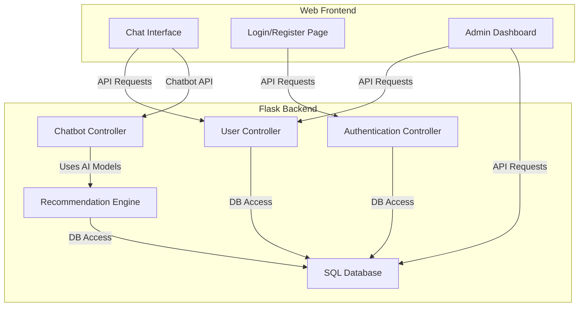

# AI-Faculty-recommendation-Sql-chatbot

## Introduction

AI-Faculty-recommendation-Sql-chatbot is an interactive chatbot system designed to recommend faculty members using advanced AI techniques and a robust SQL backend. This repository integrates machine learning, natural language processing, and database technologies to provide intelligent faculty recommendations based on user input and queries.

## Features

- AI-powered faculty recommendation based on user queries
- Natural language processing interface for seamless user interaction
- Integration with SQL database for efficient data storage and retrieval
- User authentication and login functionality
- RESTful API endpoints for chatbot interaction and user management
- Web-based frontend for chatbot communication
- Admin and user roles with distinct permissions

## Requirements

- Python 3.x
- Flask
- SQLAlchemy
- Flask-Login
- Flask-Cors
- nltk
- scikit-learn
- Flask-RESTful
- SQLite (default, can be replaced with other databases)
- JavaScript (frontend)
- HTML/CSS (frontend)

## Installation

1. Clone the repository:
   ```bash
   git clone https://github.com/KasiDEVX/AI-Faculty-recommendation-Sql-chatbot.git
   cd AI-Faculty-recommendation-Sql-chatbot
   ```
2. Create a virtual environment and activate it:
   ```bash
   python -m venv venv
   source venv/bin/activate  # On Windows: venv\Scripts\activate
   ```
3. Install the required Python packages:
   ```bash
   pip install -r requirements.txt
   ```
4. Set up the database:
   ```bash
   python
   >>> from app import db
   >>> db.create_all()
   >>> exit()
   ```
5. Start the Flask development server:
   ```bash
   python app.py
   ```
6. Open the frontend application in a browser (typically found in the `frontend` directory).

## Usage

- Launch the application and navigate to the main web interface.
- Register a new user account or log in with existing credentials.
- Enter queries in natural language. The chatbot will process your input and recommend faculty based on the database and AI models.
- Admin users can manage faculty data and view analytics.
- All chatbot interactions and user actions are handled via REST API endpoints.

### System Architecture

The application follows a modular architecture:



### REST API Endpoints

#### User Login (POST)

##### POST /login

```api
{
    "title": "User Login",
    "description": "Authenticate a user and start a session.",
    "method": "POST",
    "baseUrl": "http://localhost:5000",
    "endpoint": "/login",
    "headers": [
        {
            "key": "Content-Type",
            "value": "application/json",
            "required": true
        }
    ],
    "queryParams": [],
    "pathParams": [],
    "bodyType": "json",
    "requestBody": "{\n  \"username\": \"user1\",\n  \"password\": \"password123\"\n}",
    "responses": {
        "200": {
            "description": "Login successful.",
            "body": "{\n  \"message\": \"Login successful.\"\n}"
        },
        "401": {
            "description": "Invalid credentials.",
            "body": "{\n  \"error\": \"Invalid username or password.\"\n}"
        }
    }
}
```

#### User Registration (POST)

##### POST /register

```api
{
    "title": "User Registration",
    "description": "Register a new user account.",
    "method": "POST",
    "baseUrl": "http://localhost:5000",
    "endpoint": "/register",
    "headers": [
        {
            "key": "Content-Type",
            "value": "application/json",
            "required": true
        }
    ],
    "queryParams": [],
    "pathParams": [],
    "bodyType": "json",
    "requestBody": "{\n  \"username\": \"newuser\",\n  \"password\": \"newpassword\"\n}",
    "responses": {
        "201": {
            "description": "Registration successful.",
            "body": "{\n  \"message\": \"User registered successfully.\"\n}"
        },
        "400": {
            "description": "Invalid input data.",
            "body": "{\n  \"error\": \"Username already exists.\"\n}"
        }
    }
}
```

#### Chatbot Query (POST)

##### POST /chat

```api
{
    "title": "Chatbot Query",
    "description": "Send a message to the chatbot and receive a recommendation.",
    "method": "POST",
    "baseUrl": "http://localhost:5000",
    "endpoint": "/chat",
    "headers": [
        {
            "key": "Content-Type",
            "value": "application/json",
            "required": true
        }
    ],
    "queryParams": [],
    "pathParams": [],
    "bodyType": "json",
    "requestBody": "{\n  \"message\": \"Suggest a faculty for AI research.\"\n}",
    "responses": {
        "200": {
            "description": "Chatbot response.",
            "body": "{\n  \"response\": \"Dr. Smith is recommended for AI research.\"\n}"
        },
        "400": {
            "description": "Bad request.",
            "body": "{\n  \"error\": \"Invalid input.\"\n}"
        }
    }
}
```

#### User Logout (GET)

##### GET /logout

```api
{
    "title": "User Logout",
    "description": "Terminate the user session.",
    "method": "GET",
    "baseUrl": "http://localhost:5000",
    "endpoint": "/logout",
    "headers": [],
    "queryParams": [],
    "pathParams": [],
    "bodyType": "none",
    "requestBody": "",
    "responses": {
        "200": {
            "description": "Logout successful.",
            "body": "{\n  \"message\": \"Logged out successfully.\"\n}"
        }
    }
}
```

### Example Usage

- Register and log in via the `/register` and `/login` endpoints.
- Use the `/chat` endpoint to interact with the chatbot.
- Admin users can access management features via the frontend dashboard.

## Summary

AI-Faculty-recommendation-Sql-chatbot delivers a full-stack solution for faculty recommendation using AI and SQL. Users interact through a user-friendly web interface, with robust backend services providing authentication, recommendation logic, and data management. The modular design and RESTful APIs make it scalable and easy to extend for research or institutional use.
